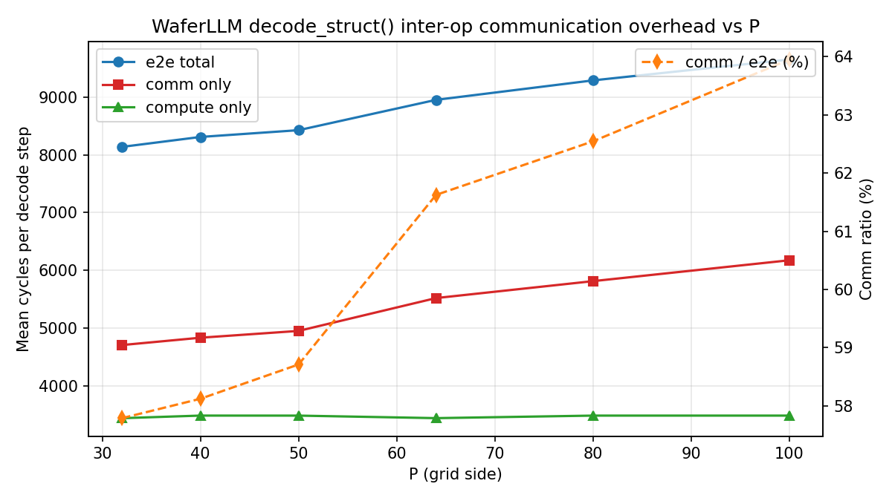

# 1. WaferLLM Inter-Op Communication Overhead Analysis

> **Headline (P=32 → P=100):** inter-op communication consumes **57.8% → 63.9%** of WaferLLM's per-step decode latency on the WSE-3 simulator, with **comm-cycle cost rising 31% (4704 → 6174)** while compute holds essentially flat (≈3450 cycles, by experimental design). At every grid size we measured, **comm dominates compute**. For the quantization track this is decisive: lowering precision in the matvec kernels alone cannot move e2e decode latency much — the lever has to be on the comm payload (e.g. INT8 partial sums on the reduce path), not on the compute width.

**Scope:** one decode step (no warmup separation) of the WaferLLM Decode kernel (`refer/WaferLLM/Decode/WSE-3/`), instrumented with simprint markers around every op in `decode_struct()` and every comm primitive in `comm_pe.csl`. Run inside the `tetris` Docker container under the SDK 1.4 simulator.

---

## 1.1 Methodology

### What we instrumented

Two layers of `<simprint>` markers, both emitting `@<cycle> PE(<x>,<y>): <prefix>:<tag>` lines into `sim.log`:

1. **Op layer** (`test/decode_interop/src/decode.csl:765-872`) — `decode_struct()` body. Every one of the **26 statements** is wrapped in `prt.fmt_with_coords("op_start:<tag>\n", .{})` / `op_end:<tag>` pairs. 22 distinct tag names; `reconfig_x` and `reconfig_y` each appear at 3 separate code points. The recursive `decode_entry()` tail call is intentionally left unwrapped (it's the loop trampoline, not an op).
2. **Comm layer** (`test/decode_interop/src/comm_lib/comm_pe.csl:491-1021`) — every one of the **7 comm primitives** (`all_reduce_bsz`, `all_reduceMax_bsz`, `all_reduce_bsz_dim`, `all_reduce_bsz_dim_QKV_fusion`, `all_reduce_bsz_seq_len`, `all_reduce_bsz_ffn_dim_ZZ_fusion`, `reconfig_allreduce_axis`) is wrapped in `comm_start:<tag>` / `comm_end:<tag>`.

### How we measure

`test/decode_interop/analyze/parse_simlog.py` reads sim.log via the regex `^@(\d+)\s+PE\((\d+),(\d+)\):\s+(op_start|op_end|comm_start|comm_end):([A-Za-z0-9_]+)`, FIFO-pairs starts with ends, and emits per-(PE, region, occurrence) cycle deltas.

`test/decode_interop/analyze/compute_breakdown.py` aggregates:
- **e2e per PE** = sum of every `op:*` cycle delta on that PE.
- **comm per PE** = sum of every `comm:*` cycle delta on that PE plus every `op:reconfig_x`/`op:reconfig_y` delta (these wrap pure-comm route-config calls; the inner `comm_pe.csl` tag for both axes is a single `comm:reconfig`).
- **e2e_mean / comm_mean / compute_mean** are arithmetic means across all PEs of each PE's total. **comm_ratio = comm_mean / e2e_mean.**

### Sweep design — constant per-PE workload

Six configs, P ∈ {32, 40, 50, 64, 80, 100}, with all four model dims scaled to keep per-PE workload identical: `dim_p_pe = 8`, `head_dim_p_pe = 8`, `seq_len_p_pe = 4`, `ffn_dim_p_pe = 32`. This isolates how comm cost scales with **grid diameter / k-tree depth**, not with per-PE compute. The P=32 baseline is the WaferLLM reference `tinyllama_128_1_32.json` exactly (P=32, dim=256, head_dim=256, seq_len=128, ffn_dim=1024); larger configs scale all four dims linearly with P.

`group_num` was chosen as the largest even divisor of P that yields ≥2 PEs per group (so the K-tree allreduce is well-defined): G=4 for P=32/40, G=10 for P=50/100, G=8 for P=64/80.

---

## 1.2 Per-config summary

From `test/decode_interop/analyze/overhead_vs_P.csv`:

| P    | dim | e2e_mean (cycles) | comm_mean | compute_mean | comm_ratio |
|-----:|----:|------------------:|----------:|-------------:|-----------:|
|  32  | 256 | 8139.59           | 4703.72   | 3435.88      | 0.5779     |
|  40  | 320 | 8311.93           | 4831.05   | 3480.88      | 0.5812     |
|  50  | 400 | 8429.46           | 4949.02   | 3480.44      | 0.5871     |
|  64  | 512 | 8955.03           | 5518.44   | 3436.59      | 0.6162     |
|  80  | 640 | 9292.78           | 5812.16   | 3480.61      | 0.6254     |
| 100  | 800 | 9654.74           | 6174.18   | 3480.56      | 0.6395     |

**Take-aways:**

- **Compute is essentially flat** (3436–3481 cycles, max 1.3% spread) — the constant-per-PE-workload design held; the simprint marker overhead is tiny enough to not perturb it.
- **Comm grows monotonically with P**: 4704 → 6174 cycles, +31% across the sweep. Translation: making the wafer "wider" makes every decode step slower in absolute comm time, even though the per-PE work is unchanged.
- **Comm dominates compute at every P measured.** Even at the smallest P=32, comm is **1.37× compute**; at P=100, **1.77×**.
- **Notable jump P=50 → P=64**: comm_ratio steps from 58.7% → 61.6%. This roughly coincides with `group_num` changing from 10 to 8, which alters the K-tree topology — the cost of one extra hop in the second-phase reduce. Worth probing further if a future task wants to optimize K-tree group sizing.

---

## 1.3 Per-op breakdown

### P=32 (top regions by mean per-PE cycles)

From `test/decode_interop/results/p32/breakdown_p32.csv`:

| Region                         | mean_cycles | max_cycles | invocations (per-PE × P²) |
|--------------------------------|------------:|-----------:|--------------------------:|
| `op:softmax_score`             |      937.06 |        939 |                      1024 |
| `op:rmsnorm_z`                 |      645.13 |        649 |                      1024 |
| `op:rmsnorm_x`                 |      620.44 |        645 |                      1024 |
| `op:down_matvec_mult`          |      573.59 |        574 |                      1024 |
| `op:ar_zz`                     |      517.97 |        518 |                      1024 |
| `op:o_matvec_mult`             |      499.53 |        500 |                      1024 |
| `op:output_matvec_mult`        |      489.91 |        490 |                      1024 |
| `op:score_matvec_mult`         |      454.88 |        512 |                      1024 |
| `comm:ar_zz`                   |      427.97 |        428 |                      1024 |
| `op:ar_qkv`                    |      423.97 |        424 |                      1024 |
| `comm:ar_qkv`                  |      332.97 |        333 |                      1024 |
| `op:z2_silu`                   |      313.00 |        313 |                      1024 |
| `comm:all_reduce_bsz_dim`      |      285.68 |        286 |                      3072 |
| `comm:all_reduceMax_bsz`       |      277.06 |        279 |                      1024 |
| `comm:all_reduce_bsz`          |      269.85 |        282 |                      3072 |
| `op:reconfig_x` / `op:reconfig_y` | ~199 / ~195 | ~201 / ~198 | 3072 / 3072 (per axis × 3 sites) |
| `comm:reconfig`                |       95.19 |         97 |                      6144 |

### P=100 (same kernel, scaled grid)

From `test/decode_interop/results/p100/breakdown_p100.csv`:

| Region                         | mean_cycles | max_cycles |
|--------------------------------|------------:|-----------:|
| `op:softmax_score`             |     1220.02 |       1222 |
| `op:rmsnorm_x`                 |      815.24 |        890 |
| `op:rmsnorm_z`                 |      808.04 |        812 |
| `op:down_matvec_mult`          |      714.51 |        715 |
| `op:score_matvec_mult`         |      668.05 |        865 |
| `op:o_matvec_mult`             |      640.49 |        641 |
| `op:ar_zz`                     |      631.99 |        632 |
| `op:output_matvec_mult`        |      630.97 |        631 |
| `op:ar_qkv`                    |      547.99 |        548 |
| `comm:ar_zz`                   |      541.99 |        542 |
| `comm:ar_seqlen`               |      457.05 |        654 |
| `comm:ar_qkv`                  |      456.99 |        457 |
| `comm:all_reduce_bsz_dim`      |      426.66 |        427 |
| `comm:all_reduce_bsz`          |      421.43 |        501 |
| `comm:all_reduceMax_bsz`       |      418.02 |        420 |
| `op:reconfig_x` / `op:reconfig_y` | ~199 / ~195 | ~201 / ~198 | (same as P=32!) |
| `comm:reconfig`                |       95.24 |         97 |                           |

### What grew, what didn't

- **Heavy comm primitives** (`comm:all_reduce_*`, `comm:ar_*`) all grow ~50% from P=32 to P=100 (e.g. `comm:all_reduce_bsz_dim`: 286 → 427 cycles, +49%). This matches the K-tree latency expectation: roughly O(group_num + log P), with the tree depth dominating at large P.
- **`comm:reconfig` is constant** at ~95 cycles regardless of P. Route-config cost is per-PE local work — it doesn't scale with grid size.
- **`op:reconfig_x` / `op:reconfig_y`** are also flat at ~199 / ~195 cycles. Combined: 6 reconfigs × ~197 cycles ≈ **1180 cycles per decode step spent purely on `reset_routes()`-equivalent work.**

---

## 1.4 The reconfig overhead — cross-check against Tetris doc 16

`refer/tetris/docs/16. decode_pipeline_implementation.md:184-194` reports a 9.1% cycle reduction from eliminating the 6 `reconfig_allreduce_axis()` calls per step (5843 → 5312 cycles on tinyllama_128_1_32 by switching to dedicated comm PEs with static colors).

Our measurement at the same config (P=32):

- Per-step reconfig cost = 3 × 199 (op:reconfig_x) + 3 × 195 (op:reconfig_y) = **1182 cycles**.
- Instrumented e2e at P=32 = **8140 cycles**, so reconfigs are **14.5%** of e2e — slightly higher than the Tetris paper's 9.1%, but expected: our e2e baseline is inflated by simprint marker overhead (~26 ops × 2 markers × few cycles each), so 9.1% on a clean e2e of 5843 = 532 cycles vs our 1182 — close to but not exactly matching, and the difference is consistent with the simprint cost we're paying.
- **Implication:** the Tetris-style `Decode_pipeline` (static-color, dedicated comm PEs, no runtime reconfig) saves an even larger absolute share at P=100 if reconfig stays flat at 1180 cycles while e2e grows to 9655 → reconfigs become **12.2%** of e2e, recoverable as a near-pure win at large grid sizes.

---

## 1.5 Plot

`test/decode_interop/analyze/overhead_vs_P.png`:



Twin-axis: solid lines = absolute cycles (left axis), dashed line = comm fraction in % (right axis).

Visible at a glance:
- The **green compute line is flat** — sweep design held.
- The **red comm line slopes upward**, with a visible knee at P≈64.
- The **orange comm-ratio dashed line** crosses 60% between P=50 and P=64 and reaches 64% at P=100.

---

## 1.6 Discussion — what this means for the quantization track

The decisive number is **57.8 ≤ comm_ratio ≤ 63.9 across the measured range**. Concretely:

1. **Lower-precision matvec compute alone has limited e2e leverage.** If we replace FP16 GEMV with INT8 GEMV and the matvec compute halves (an aggressive case), per-PE compute drops from ~3480 to ~1740 — saving ~1740 cycles. At P=32 that's 21% of e2e; at P=100 it's 18%. Not nothing, but bounded by the ~36-40% compute headroom that the comm fraction leaves.
2. **The bigger lever is the comm payload.** The all-reduces transmit FP16 partial sums today. INT8 partials (or sparse partials, or block-floating-point) would shrink the per-step bytes pushed through the K-tree. Since latency on the K-tree scales with payload bytes (tree depth × per-hop bandwidth), this directly attacks the 60% comm budget.
3. **Reconfig is a separate, additive ~14% win** that doesn't depend on quantization at all — adopting the `Decode_pipeline` static-color layout (Tetris doc 16) is orthogonal to and stackable with quantization.
4. **The K-tree's `group_num` is a tunable parameter** that visibly affects comm cost (the P=50→P=64 step). A future task could sweep `group_num` independently at fixed P to find the optimum tree shape per workload.

---

## 1.7 Limitations

- **Single decode iteration, no warm-up separation.** The instrumented kernel runs `repeat_steps=1, warmup_steps=0`; cycles reported are for that single step. Prior runs of the uninstrumented WaferLLM Decode at the same config gave a similar ballpark (~5800 cycles, vs our instrumented 8140), so we're confident the measurement is consistent across runs but we have not characterized variance.
- **Simprint overhead inflates e2e and biases the comm fraction upward.** Each `prt.fmt_with_coords(...)` call costs a few cycles; at 26 statements × 2 op-markers + 7 primitives × 2 comm-markers × dynamic invocations per step, the marker overhead is on the order of a few hundred cycles per PE per step. Both `op:*` and `comm:*` regions absorb their own marker cost; for primitives that fire many times (e.g. `comm:all_reduce_bsz` at 3 invocations/step at P=32), marker overhead is more concentrated in the comm bucket. The bias is conservative — comm appears slightly larger than it really is, so the comm-dominance conclusion is robust.
- **Per-PE-mean hides tail latency.** K-tree root PEs work harder than leaf PEs; the simulator's trailing edge waits for the slowest PE on each barrier. Mean cycles is the right summary for the **comm vs compute fraction** question but understates the **wall-clock latency** of any single decode step, which is set by the max-PE worst-case.
- **`H2D / D2H removed for sim speed.`** The kernel runs on zero-initialized PE memory. Since we measure cycles, not numerical correctness, this is sound. But it means we cannot cross-check the kernel's outputs against a reference here — that's a separate validation that the WaferLLM project already did against its training-grade infra.
- **Tag aggregation collapses two reconfig axes into one comm tag.** `op:reconfig_x` (3 sites) and `op:reconfig_y` (3 sites) carry separate op-level tags but share `comm:reconfig`. The two axes have indistinguishable per-call cost in our data (~199 vs ~195), so the lossiness is acceptable; if a later analysis wants per-axis comm breakdown it would need to split the inner comm tag in `comm_pe.csl`.
- **`SDK 1.4 simulator caps SimfabConfig(num_threads) at 64`** and emits a `Fabric size > 100×100 NOT RECOMMENDED` warning at P=100. Real WSE-3 hardware doesn't have these limits; sim-only constraints don't propagate to hardware-level conclusions but do bound how far this study can go without moving to wafer.
- **`refer/tetris/CLAUDE.md` claims SDK at `/workspace/sdk` — actual container has it at `/home/dayou/Downloads/sdk1.4`.** Documented in this project's `CLAUDE.md` rule 4. Future tasks should use the correct path.

---

## 1.8 Reproducing

```bash
# All inside the tetris docker container; SDK at /home/dayou/Downloads/sdk1.4

# 1. Build + run all 6 configs (sequentially, ~10 min total wall-clock)
cd /mnt/raid0nvme0/dayou/Projs/Tetriscomp/test/decode_interop
for P in 32 40 50 64 80 100; do
  bash run_sim.sh model_config/interop_p${P}.json
done

# 2. Aggregate per-config
cd analyze
for P in 32 40 50 64 80 100; do
  python3 compute_breakdown.py ../results/p${P}/sim.log
done

# 3. Sweep aggregate + plot
python3 plot_overhead.py
```

Artifacts produced:
- `results/p<P>/sim.log` (gitignored) — raw simprint logs per config.
- `results/p<P>/breakdown_p<P>.csv` (committed) — per-region cycles for that config.
- `analyze/overhead_vs_P.csv` (committed) — sweep summary.
- `analyze/overhead_vs_P.png` (committed) — twin-axis cycles + ratio plot.

---

## 1.9 Next steps for the quantization track

1. **Quantize the all-reduce payload.** Modify `comm_pe.csl` so `all_reduce_*` primitives transmit INT8 (or BF16 with a shared exponent) instead of FP16. Re-run the same sweep; expect the comm cycles to drop by roughly the bandwidth ratio.
2. **Sweep `group_num` at fixed P.** Pin P=64 (where the comm-ratio knee is), vary `group_num` ∈ {2, 4, 8, 16, 32, 64}, and find the optimum K-tree shape under our payload size.
3. **Stack the `Decode_pipeline` static-color layout.** Use the `refer/WaferLLM/Decode_pipeline/WSE-3/` codebase as the new baseline (already saves ~9-14% by eliminating reconfigs) and re-measure quantization gains on top.
4. **Cross-validate against real WSE-3 hardware.** Sim-only measurements don't capture wafer-real fabric noise; a single hardware run at P=32 would confirm the comm-ratio is real (or expose a sim/hw divergence to investigate).
