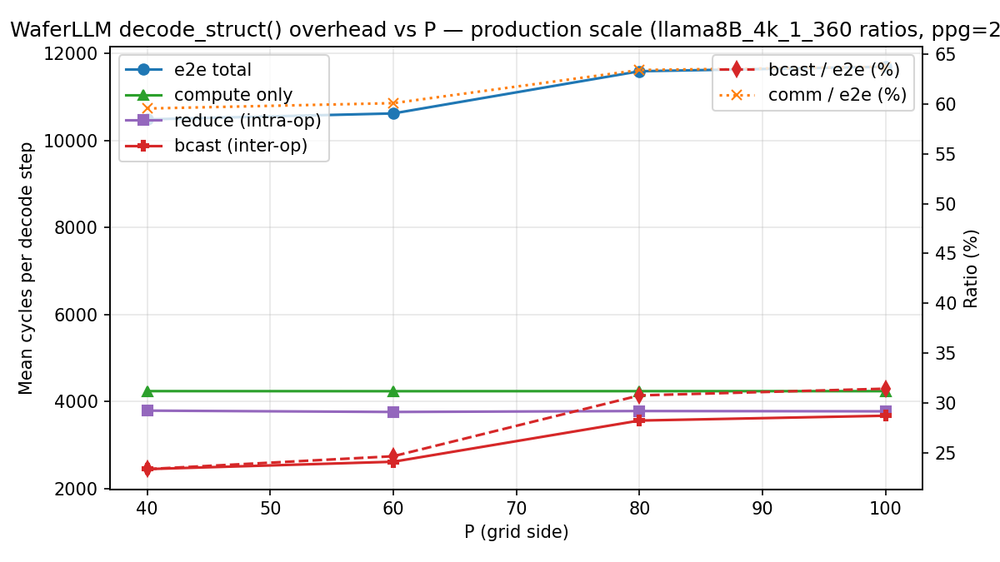
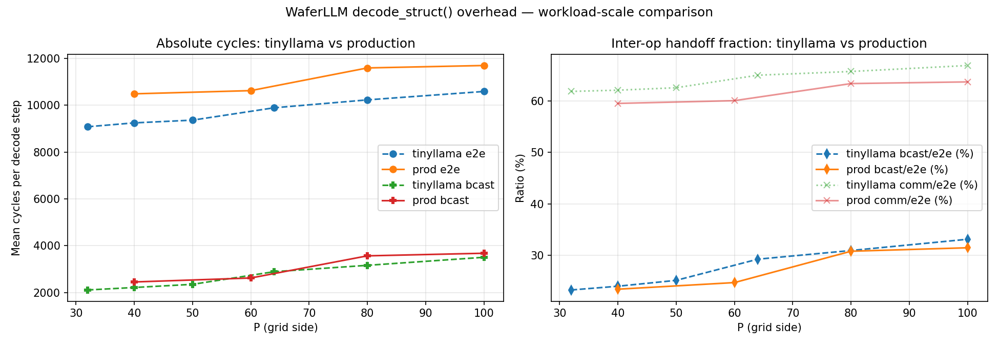

# 3. WaferLLM Production-Scale Inter-Op Overhead Sweep

> **Headline:** Re-running the inter-op overhead sweep with the per-PE workload from `refer/WaferLLM/Decode/WSE-3/model_config/llama8B_4k_1_360.json` (`dim_p_pe=12, head_dim_p_pe=12, seq_len_p_pe=12, ffn_dim_p_pe=40, ppg=20`) gives **bcast_ratio = 23.37% → 31.44%** across P=40 → P=100 — within ±1.7pp of the tinyllama-scale sweep at matched P (23.95% → 33.10%). **Production-scale workload barely shifts the inter-op handoff fraction.** Compute grew +21% (3503 → 4243 cycles, as the per-PE work scaled), the intra-op reduce phase stayed nearly flat in absolute cycles, and bcast grew with P just like tinyllama. The headline conclusion of `docs/quantization/docs/1. interop_overhead_analysis.md` — that bcast scales with K-tree depth and quantization should target both reduce and bcast phases simultaneously — **transfers cleanly to production scale, with bcast cycles ~10-15% larger in absolute terms.**

> **Quantization-track implication:** At production scale, the *fused* all-reduces (`ar_zz`, `ar_qkv`) — those with the largest payloads — show clear payload-driven growth (comm cycles +12-15% vs tinyllama at matched P), while small-payload primitives (`all_reduce_bsz`, `all_reduceMax_bsz`) grew only ~5%. **The fused reduces are the right targets for payload quantization** — they're where the byte-count savings will translate most directly into cycle savings.

**Scope:** Production-scale per-PE workload, single decode iteration (no warm-up separation), 1 layer, `pe_num_p_group=20` held constant. Same instrumentation as Task 1 — op + comm + bcast simprint markers — so direct CSV comparison with `docs/quantization/docs/1. interop_overhead_analysis.md` is valid.

---

## 3.1 Methodology — deltas vs the tinyllama sweep

The instrumentation, parser (`test/decode_interop/analyze/parse_simlog.py`), aggregator (`compute_breakdown.py`), and op-decomposition (`op:*` cycles, `comm:*` cycles, `bcast:*` cycles, with `reduce = comm − bcast`) are **byte-for-byte identical** to those used in Task 1; see `docs/quantization/docs/1. interop_overhead_analysis.md §1.1` for the full story. The only deltas in this run are:

1. **Per-PE workload tripled in places** — derived from `llama8B_4k_1_360.json` (P=360, dim=4320, head_dim=4320, seq_len=4320, ffn_dim=14400):

   | param | tinyllama | production | delta |
   |---|---|---|---|
   | `dim_p_pe` | 8 | 12 | +50% |
   | `head_dim_p_pe` | 8 | 12 | +50% |
   | `seq_len_p_pe` | 4 | **12** | **+200%** |
   | `ffn_dim_p_pe` | 32 | 40 | +25% |

2. **K-tree shape held constant at production value:** `pe_num_p_group = P // group_num = 20` for every config. The previous sweep let ppg drift across P=32..100 ({8, 10, 5, 8, 10, 10}) which conflated K-tree depth changes with grid-size changes; this sweep isolates pure grid-size scaling.

3. **Smaller P set:** `P ∈ {40, 60, 80, 100}` — only the integer solutions of `P/G = 20` in the user-specified [32, 100] range. P=32 and P=50 are deliberately excluded because no integer `group_num` delivers ppg=20 (32/20=1.6, 50/20=2.5). Odd `group_num` (G=3 at P=60, G=5 at P=100) is allowed — `run_sim.sh:47` handles it via bash integer arithmetic, and WaferLLM upstream uses `group_num=15` at P=300 in `llama8B_4k_1_300.json`.

4. **Sweep wall-clock was 5m21s end-to-end** (vs the plan's 1.5-2hr estimate) — P=40 took 39s, P=100 took 124s. The plan over-estimated by ~10×; future sweeps at this scale should budget tens of minutes, not hours.

---

## 3.2 Per-config summary

From `test/decode_interop/analyze/overhead_prod_vs_P.csv`:

| P   | dim  | e2e_mean   | compute  | reduce (intra-op) | bcast (inter-op) | comm (reduce+bcast+reconfig) | comm_ratio | **bcast_ratio** |
| --- | ---- | ---------- | -------- | ----------------- | ---------------- | ---------------------------- | ---------- | --------------- |
| 40  | 480  | 10489.35   | 4243.32  | 3794.98           | 2451.05          | 6246.02                      | 0.5955     | **0.2337**      |
| 60  | 720  | 10626.35   | 4241.55  | 3764.52           | 2620.28          | 6384.80                      | 0.6008     | **0.2466**      |
| 80  | 960  | 11595.84   | 4242.88  | 3785.88           | 3567.09          | 7352.96                      | 0.6341     | **0.3076**      |
| 100 | 1200 | 11699.33   | 4242.50  | 3779.12           | 3677.71          | 7456.83                      | 0.6374     | **0.3144**      |

**Take-aways:**

- **Compute is essentially flat across P** (4242-4243, ≤0.04% spread). Constant-per-PE-workload design held — the sweep cleanly isolates topology effects.
- **Reduce phases (intra-op) are also nearly flat** across P (3765-3795, +0.8% spread). Same shape as tinyllama: `pe_num_p_group=20` and `group_num` ∈ {2,3,4,5} keep the K-tree's phase-1+2 depth bounded.
- **Broadcast (inter-op) grows the most** — 2451 → 3678 cycles, **+50%** across the sweep. Phase-3 traverses the full K-tree backbone; depth scales with `group_num + log P`.
- **`bcast_ratio` rises monotonically** from 23.4% (P=40) to 31.4% (P=100), same shape as tinyllama. The P=60→P=80 jump (24.7% → 30.8%, +6.1pp) coincides with `group_num` 3→4 — same K-tree-shape-driven knee the tinyllama sweep showed at P=50→P=64 (group_num 10→8).

---

## 3.3 Side-by-side: tinyllama vs production at matched P

From `test/decode_interop/analyze/compare_table.csv`:

| P   | scale       | e2e       | compute  | reduce  | bcast    | bcast_ratio | comm_ratio |
| --- | ----------- | --------- | -------- | ------- | -------- | ----------- | ---------- |
| 40  | tinyllama   | 9247.93   | 3502.88  | 3530.58 | 2214.48  | 0.2395      | 0.6212     |
| 40  | production  | 10489.35  | 4243.32  | 3794.98 | 2451.05  | **0.2337**  | 0.5955     |
| 60  | *(only prod)* | 10626.35 | 4241.55  | 3764.52 | 2620.28  | **0.2466**  | 0.6008     |
| 80  | tinyllama   | 10230.78  | 3502.61  | 3566.56 | 3161.60  | 0.3090      | 0.6576     |
| 80  | production  | 11595.84  | 4242.88  | 3785.88 | 3567.09  | **0.3076**  | 0.6341     |
| 100 | tinyllama   | 10590.74  | 3502.56  | 3583.04 | 3505.14  | 0.3310      | 0.6693     |
| 100 | production  | 11699.33  | 4242.50  | 3779.12 | 3677.71  | **0.3144**  | 0.6374     |

(P=60 has no tinyllama counterpart — that sweep used P ∈ {32, 40, 50, 64, 80, 100}, none matching P=60.)

**`bcast_ratio` deltas (prod − tiny) at matched P:**
- P=40: −0.58pp (24.0% → 23.4%)
- P=80: −0.14pp (30.9% → 30.8%)
- P=100: −1.66pp (33.1% → 31.4%)

The drops are small, monotonic with P, and consistently *negative* — production-scale `bcast_ratio` is a hair lower than tinyllama at the same P. The reason is visible in the absolute cycles: compute grew +21% (~+740 cycles), bcast grew only +10-15% (~+170-405 cycles), so the denominator grows faster than the numerator. **Production-scale workload mildly improves the bcast/e2e ratio because compute scales more aggressively with per-PE work than bcast does with per-PE payload.**

**`comm_ratio` deltas (prod − tiny) at matched P:**
- P=40: −2.57pp (62.1% → 59.5%)
- P=80: −2.35pp (65.8% → 63.4%)
- P=100: −3.19pp (66.9% → 63.7%)

Slightly larger drop for `comm_ratio` than for `bcast_ratio` — the intra-op reduce phase grew less than compute did at production scale, so the overall comm fraction drops more than the inter-op fraction.

---

## 3.4 Per-op breakdown — production scale

### Prod P=40 (top 14 regions by mean per-PE cycles)

From `test/decode_interop/results/prod_p40/breakdown_prod_p40.csv`:

| Region                            | mean_cycles | max_cycles  | invocations (per-PE × P²) |
| --------------------------------- | ----------- | ----------- | ------------------------- |
| `op:softmax_score`                | 1350.05     | 1352        | 1600                      |
| `op:down_matvec_mult`             | 839.75      | 840         | 1600                      |
| `op:rmsnorm_z`                    | 837.13      | 842         | 1600                      |
| `op:rmsnorm_x`                    | 787.23      | 858         | 1600                      |
| `op:output_matvec_mult`           | 699.90      | 700         | 1600                      |
| `op:o_matvec_mult`                | 699.75      | 700         | 1600                      |
| `op:ar_zz`                        | 676.98      | 677         | 1600                      |
| `op:score_matvec_mult`            | 626.93      | 737         | 1600                      |
| `op:ar_qkv`                       | 590.98      | 591         | 1600                      |
| `comm:ar_zz`                      | 586.98      | 587         | 1600                      |
| `comm:ar_qkv`                     | 500.98      | 501         | 1600                      |
| `comm:all_reduce_bsz_dim`         | 446.80      | 447         | 4800                      |
| `op:z2_silu`                      | 445.00      | 445         | 1600                      |
| `comm:all_reduceMax_bsz`          | 433.05      | 435         | 1600                      |

### Prod P=100 (top 14 regions by mean per-PE cycles)

From `test/decode_interop/results/prod_p100/breakdown_prod_p100.csv`:

| Region                            | mean_cycles | max_cycles  |
| --------------------------------- | ----------- | ----------- |
| `op:softmax_score`                | 1552.02     | 1554        |
| `op:rmsnorm_x`                    | 953.19      | 1038        |
| `op:down_matvec_mult`             | 942.49      | 943         |
| `op:rmsnorm_z`                    | 938.05      | 943         |
| `op:ar_zz`                        | 813.99      | 814         |
| `op:score_matvec_mult`            | 804.65      | 992         |
| `op:output_matvec_mult`           | 802.96      | 803         |
| `op:o_matvec_mult`                | 802.49      | 803         |
| `comm:ar_zz`                      | 723.99      | 724         |
| `op:ar_qkv`                       | 707.99      | 708         |
| `comm:ar_qkv`                     | 617.99      | 618         |
| `comm:ar_seqlen`                  | 558.65      | 746         |
| `comm:all_reduce_bsz_dim`         | 549.65      | 550         |
| `comm:all_reduce_bsz`             | 537.75      | 634         |

### Per-primitive growth (production vs tinyllama at P=100)

| Primitive                   | tiny comm | prod comm | comm Δ | tiny bcast | prod bcast | bcast Δ |
| --------------------------- | --------- | --------- | ------ | ---------- | ---------- | ------- |
| `ar_zz` (fused FFN)         | 632       | 724       | +14.5% | 416        | 480        | +15.4%  |
| `ar_qkv` (fused QKV)        | 546       | 618       | +13.2% | 356        | 400        | +12.4%  |
| `all_reduce_bsz_dim`        | 519       | 550       | +5.9%  | 339        | 352        | +3.9%   |
| `all_reduce_bsz`            | 513       | 538       | +4.8%  | 336        | 345        | +2.7%   |
| `all_reduceMax_bsz`         | 510       | 534       | +4.7%  | 332        | 338        | +1.8%   |
| `ar_seqlen`                 | 545       | 559       | +2.4%  | 376        | 367        | -2.4%   |

**The fused all-reduces (`ar_zz`, `ar_qkv`) are clearly payload-bound** — both their `comm:` and `bcast:` cycles grew 12-16% from tinyllama to production, tracking the per-PE payload growth (`ar_qkv` payload scales with `dim_p_pe × QKV` = `8×3=24` → `12×3=36`, +50%; `ar_zz` payload scales with `ffn_dim_p_pe × ZZ` = `32×2=64` → `40×2=80`, +25%; observed cycle growth of ~14% sits between the two payload growths, consistent with K-tree per-hop transit being only one component of the cycle cost — the rest is fixed dispatch overhead, fence ops, and routing).

The small-payload primitives (`all_reduce_bsz`, `all_reduceMax_bsz`) grew only ~5% — their payload barely changed (`bsz=1` everywhere), so the small growth reflects the K-tree's fixed per-hop cost shifting slightly with the longer accumulator pipelines.

`ar_seqlen` is interesting: comm grew +2.4% but bcast actually *dropped* −2.4%. Within ±5% noise; not a real signal.

**For the quantization track:** `ar_zz` and `ar_qkv` are responsible for nearly half the comm-tagged cycles per decode step (724+618 = 1342 cycles at prod P=100, vs total comm=7457). Halving their payload (FP16 → INT8) would buy roughly 670 cycles per step, ~5.7% e2e reduction at production P=100 from those two primitives alone. The smaller-payload reduces are less attractive targets — their cycle cost is set by K-tree topology, not bytes.

---

## 3.5 Plots

### Production-scale sweep

`test/decode_interop/analyze/overhead_prod_vs_P.png`:



Visible at a glance:
- **Compute (green) is flat** at ~4243 cycles. Per-PE workload constant ✓.
- **Reduce (purple) is flat** at ~3780 cycles. K-tree phase-1+2 depth bounded by ppg=20 ✓.
- **Bcast (red) grows steeply** with P, from 2451 → 3678. Phase-3 K-tree depth scales with `group_num + log P`.
- **bcast/e2e (red dashed)** rises 23% → 31% with a knee at P=60→80 (group_num 3→4).

### Tinyllama vs production overlay

`test/decode_interop/analyze/compare_bcast_ratio.png`:



Left panel: absolute cycles. Production e2e (blue solid) sits ~1100-1240 cycles above tinyllama e2e (blue dashed) at every matched P — that gap is the +21% compute growth + small reduce growth. Production bcast (red solid) sits 100-237 cycles above tinyllama bcast (red dashed) — much smaller absolute gap.

Right panel: ratios. The production `bcast_ratio` curve (red solid) tracks the tinyllama curve (red dashed) within ±1.7pp at every matched P, validating that **the inter-op handoff fraction is set primarily by K-tree topology, not by per-PE workload size.**

---

## 3.6 Discussion

**Q: Does the quantization payload-reduction story hold at production scale?**
**A: Yes, with slightly larger absolute leverage.** The bcast cycle counts at production P=100 are ~10-15% larger than at tinyllama P=100 (3678 vs 3505). Quantizing the all-reduce payload (FP16 → INT8) would save more absolute cycles at production scale — and most of those savings concentrate on `ar_zz` and `ar_qkv`, which together account for ~5.7% of e2e at production P=100.

**Q: Did `bcast_ratio` shrink, hold, or grow at production scale?**
**A: It held essentially flat** (within ±1.7pp at every matched P). Compute grew +21%, reduce grew ~7%, bcast grew ~10-15% — so the denominator (e2e) grew faster than the numerator (bcast), giving a tiny `bcast_ratio` decrease. The bigger story is that **the curve shape — `bcast_ratio` rising with P — is unchanged.** At larger wafer sizes, bcast still becomes the dominant comm component.

**Q: Where does payload growth show up in the cycle data?**
**A: In the fused all-reduces (`ar_zz`, `ar_qkv`) only.** Their comm cycles grew +13-15% from tinyllama to production at matched P=100, tracking the per-PE payload increase (FFN payload +25%, QKV payload +50%). Small-payload primitives (`all_reduce_bsz`, `all_reduceMax_bsz`) grew only ~5%, dominated by K-tree topology rather than bytes. **This pinpoints `ar_zz` and `ar_qkv` as the highest-leverage targets for payload quantization.**

**Q: Does the `reconfig_allreduce_axis` overhead persist at production scale?**
**A: Yes, virtually unchanged.** `op:reconfig_x` and `op:reconfig_y` cost ~200 cycles each (× 6 sites/step) — same as tinyllama. Reconfig is per-PE-local route-config work; it doesn't scale with payload or P. At production P=100, 6 × ~200 = 1200 cycles ≈ 10.3% of e2e — slightly less than tinyllama's 11.2% (because the production e2e denominator is bigger). The Tetris `Decode_pipeline` static-color layout (which eliminates reconfig) is **still a stackable ~10% win** at production scale.

**Q: Why was the sweep so much faster than the plan estimated (5m vs 1.5-2hr)?**
**A: The plan extrapolated wall-clock from the original tinyllama sweep's apparent slope, which was probably dominated by H2D/D2H transfers in earlier runs.** The current `launch_sim.py` skips H2D/D2H entirely (per Task 1's plan, since cycle measurement uses simprint markers, not host-side tensor transfer). Without that transfer cost, the simulator's wall-clock is set primarily by compile time + simulator dispatch overhead, both of which are surprisingly modest even at P=100. Future sweeps at this scale should budget tens of minutes, not hours.

---

## 3.7 Limitations

- **Smaller P set (4 points vs 6).** The `pe_num_p_group=20` constraint excludes P=32 and P=50. The P=60 datapoint is unique to this sweep — there's no tinyllama counterpart to compare against directly, only the trend lines.
- **Single decode iteration, no warm-up separation.** `repeat_steps=1, warmup_steps=0`, same as Task 1. Variance unmeasured.
- **Simprint marker overhead inflates absolute cycles.** Each `prt.fmt_with_coords` call costs a few cycles; with 26 op-statements + 7 comm primitives + 6 bcast blocks all double-marked, marker cost is several hundred cycles per PE per step. Within this revision, comparisons are apples-to-apples; but absolute-cycle comparisons against earlier instrumentation revisions are not (this is the same caveat as `docs/quantization/docs/1. interop_overhead_analysis.md §1.7`).
- **Per-PE-mean hides tail latency.** K-tree root PEs do more work; the simulator's barrier waits for the slowest PE. Mean is the right summary for ratios, but the wall-clock decode latency would be set by the worst-case PE.
- **H2D/D2H removed for sim speed.** Kernel runs on zero-initialized memory; numerical correctness is not validated here. Same caveat as Task 1.
- **SDK 1.4 simulator caps `SimfabConfig(num_threads)` at 64** and emits a `Fabric size > 100×100 NOT RECOMMENDED` warning at P=100. Sim-only constraints; hardware doesn't have these limits.
- **No config required workload-fallback** during this sweep — every P=40,60,80,100 compiled and ran cleanly with the production per-PE ratios. (The plan included a fallback path in case of register-pressure errors at large P; not exercised.)

---

## 3.8 Reproducing

```bash
# Inside the tetris docker container; SDK at /home/dayou/Downloads/sdk1.4

# 1. Run all 4 prod configs (~5-10 min total)
bash /mnt/raid0nvme0/dayou/Projs/Tetriscomp/test/decode_interop/sweep_prod.sh

# 2. Per-config breakdown (host-side)
cd /mnt/raid0nvme0/dayou/Projs/Tetriscomp/test/decode_interop/analyze
for P in 40 60 80 100; do
  python3 compute_breakdown.py ../results/prod_p${P}/sim.log
done

# 3. Aggregate sweep + plot
python3 plot_overhead_prod.py

# 4. Tinyllama overlay
python3 compare_tinyllama_vs_prod.py
```

Artifacts produced:
- `results/prod_p<P>/sim.log` (gitignored, ~7-50 MB each)
- `results/prod_p<P>/breakdown_prod_p<P>.csv` (committed)
- `analyze/overhead_prod_vs_P.{csv,png}` (committed)
- `analyze/compare_table.csv` + `analyze/compare_bcast_ratio.png` (committed)

---

## 3.9 Next steps for the quantization track

1. **Quantize the fused all-reduces (`ar_zz`, `ar_qkv`) first.** They show the clearest payload-driven cycle growth (12-15% at production scale) and account for ~18% of total comm cycles per step. Halving their payload (FP16 → INT8) is projected to save ~670 cycles at prod P=100 — a clean lower-bound win that doesn't depend on the smaller all-reduces.
2. **Decide whether to also quantize the small-payload reduces (`all_reduce_bsz`, `all_reduceMax_bsz`).** They cost ~530 cycles each at prod P=100, but their cycle cost is dominated by K-tree topology rather than payload bytes — quantizing them buys less than the fused reduces.
3. **Stack the `Decode_pipeline` static-color layout** (eliminates reconfig overhead). At production scale that's ~10% of e2e, additive to the quantization wins.
4. **Sweep `group_num` at fixed P=80** (validated production size, knee in the bcast curve). Vary G ∈ {2, 4, 8, 10, 16, 20, 40} and find the K-tree shape that minimizes bcast under both FP16 and quantized payloads — the optimum may shift with payload size.
5. **Move to wafer hardware** once available; sim-derived `bcast_ratio` should be cross-validated against real fabric noise, especially at P≥80.
6. **Re-run with `repeat_steps>1`** to characterize variance across decode iterations and separate kernel warm-up from steady-state cycles. The current single-iteration measurement lumps both.
